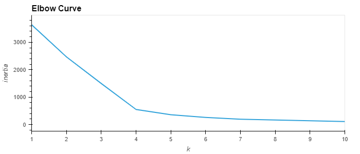
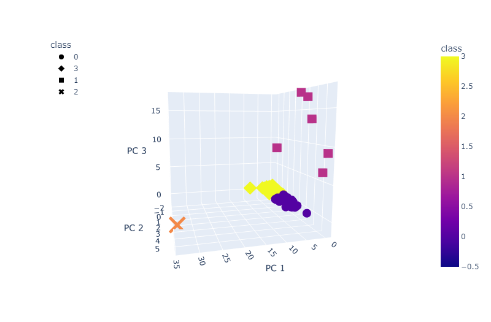
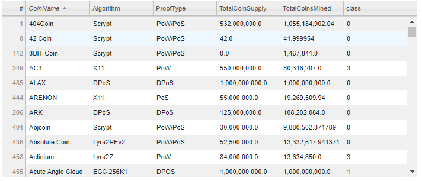
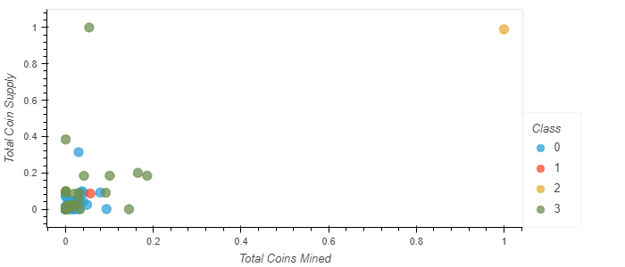

# Unsupervised Learning of Cryptocurrency Data
## Project Overview
This project seeks to employ an unsupervised categorization model of cryptocurrencies using a principal component analysis approach to identify what cryptocurrencies are on the trading market and how they could be grouped to create a classification system for investment. This project uses the crypto_data.csv datafile obtained from [CryptoCompare](https://min-api.cryptocompare.com/data/all/coinlist). The project workflow is as follows:
1. Preprocessing the Data for PCA
2. Reducing Data Dimensions Using PCA
3. Clustering Cryptocurrencies Using K-means
4. Visualizing Cryptocurrencies Results

## Results : Visualization of the K-Means Classification using PCA

### Elbow Curve in Optimization of K-selection


### 3D Scatter of the categories based on 3 principal components and a k=4 clusters


### Interactive Sortable and Selectable Table of the Tradable Cryptocurrencies


### 2D Scatter Plot of the Total Coins Mined vs. Supply for the K-Means Categories



### Clustering Crypto Code


```python
# Initial imports
import pandas as pd
import hvplot.pandas
from path import Path
import plotly.express as px
from sklearn.preprocessing import StandardScaler, MinMaxScaler
from sklearn.decomposition import PCA
from sklearn.cluster import KMeans

```

### 1: Preprocessing the Data for PCA


```python
# Load the crypto_data.csv dataset.
csv = 'crypto_data.csv'
df = pd.read_csv(csv, index_col='Unnamed: 0')
df.sample(10)
```


<div>

<table border="1" class="dataframe">
  <thead>
    <tr style="text-align: right;">
      <th></th>
      <th>CoinName</th>
      <th>Algorithm</th>
      <th>IsTrading</th>
      <th>ProofType</th>
      <th>TotalCoinsMined</th>
      <th>TotalCoinSupply</th>
    </tr>
  </thead>
  <tbody>
    <tr>
      <th>ALTCOM</th>
      <td>AltCommunity Coin</td>
      <td>SkunkHash</td>
      <td>True</td>
      <td>PoW/PoS</td>
      <td>0.000000e+00</td>
      <td>5000000</td>
    </tr>
    <tr>
      <th>PLTC</th>
      <td>PlatinCoin</td>
      <td>CryptoNight</td>
      <td>True</td>
      <td>PoW</td>
      <td>8.430000e+04</td>
      <td>600000518</td>
    </tr>
    <tr>
      <th>XSN</th>
      <td>Stakenet</td>
      <td>X11</td>
      <td>True</td>
      <td>TPoS</td>
      <td>7.559037e+07</td>
      <td>76500000</td>
    </tr>
    <tr>
      <th>NTRN</th>
      <td>Neutron</td>
      <td>SHA-256</td>
      <td>True</td>
      <td>PoW/PoS</td>
      <td>3.912169e+07</td>
      <td>68000000</td>
    </tr>
    <tr>
      <th>EB3</th>
      <td>EB3coin</td>
      <td>Scrypt</td>
      <td>True</td>
      <td>PoW</td>
      <td>6.409605e+07</td>
      <td>4000000000</td>
    </tr>
    <tr>
      <th>TELL</th>
      <td>Tellurion</td>
      <td>X11</td>
      <td>True</td>
      <td>PoW/PoS</td>
      <td>NaN</td>
      <td>3652422000</td>
    </tr>
    <tr>
      <th>CRU</th>
      <td>Curium</td>
      <td>X11</td>
      <td>True</td>
      <td>PoW</td>
      <td>0.000000e+00</td>
      <td>22000000</td>
    </tr>
    <tr>
      <th>ADC</th>
      <td>AudioCoin</td>
      <td>Scrypt</td>
      <td>True</td>
      <td>PoW/PoS</td>
      <td>9.807325e+08</td>
      <td>10500000000</td>
    </tr>
    <tr>
      <th>HERB</th>
      <td>HerbCoin</td>
      <td>Quark</td>
      <td>True</td>
      <td>PoW/PoS</td>
      <td>3.531219e+07</td>
      <td>54000000</td>
    </tr>
    <tr>
      <th>FRN</th>
      <td>Francs</td>
      <td>Scrypt</td>
      <td>True</td>
      <td>PoW</td>
      <td>6.570808e+06</td>
      <td>20000000</td>
    </tr>
  </tbody>
</table>
</div>


```python
df.dtypes
```


    CoinName            object
    Algorithm           object
    IsTrading             bool
    ProofType           object
    TotalCoinsMined    float64
    TotalCoinSupply     object
    dtype: object


```python
# Keep all the cryptocurrencies that are being traded.
df = df[(df.IsTrading == True)]
df
```


<div>

<table border="1" class="dataframe">
  <thead>
    <tr style="text-align: right;">
      <th></th>
      <th>CoinName</th>
      <th>Algorithm</th>
      <th>IsTrading</th>
      <th>ProofType</th>
      <th>TotalCoinsMined</th>
      <th>TotalCoinSupply</th>
    </tr>
  </thead>
  <tbody>
    <tr>
      <th>42</th>
      <td>42 Coin</td>
      <td>Scrypt</td>
      <td>True</td>
      <td>PoW/PoS</td>
      <td>4.199995e+01</td>
      <td>42</td>
    </tr>
    <tr>
      <th>365</th>
      <td>365Coin</td>
      <td>X11</td>
      <td>True</td>
      <td>PoW/PoS</td>
      <td>NaN</td>
      <td>2300000000</td>
    </tr>
    <tr>
      <th>404</th>
      <td>404Coin</td>
      <td>Scrypt</td>
      <td>True</td>
      <td>PoW/PoS</td>
      <td>1.055185e+09</td>
      <td>532000000</td>
    </tr>
    <tr>
      <th>611</th>
      <td>SixEleven</td>
      <td>SHA-256</td>
      <td>True</td>
      <td>PoW</td>
      <td>NaN</td>
      <td>611000</td>
    </tr>
    <tr>
      <th>808</th>
      <td>808</td>
      <td>SHA-256</td>
      <td>True</td>
      <td>PoW/PoS</td>
      <td>0.000000e+00</td>
      <td>0</td>
    </tr>
    <tr>
      <th>...</th>
      <td>...</td>
      <td>...</td>
      <td>...</td>
      <td>...</td>
      <td>...</td>
      <td>...</td>
    </tr>
    <tr>
      <th>SERO</th>
      <td>Super Zero</td>
      <td>Ethash</td>
      <td>True</td>
      <td>PoW</td>
      <td>NaN</td>
      <td>1000000000</td>
    </tr>
    <tr>
      <th>UOS</th>
      <td>UOS</td>
      <td>SHA-256</td>
      <td>True</td>
      <td>DPoI</td>
      <td>NaN</td>
      <td>1000000000</td>
    </tr>
    <tr>
      <th>BDX</th>
      <td>Beldex</td>
      <td>CryptoNight</td>
      <td>True</td>
      <td>PoW</td>
      <td>9.802226e+08</td>
      <td>1400222610</td>
    </tr>
    <tr>
      <th>ZEN</th>
      <td>Horizen</td>
      <td>Equihash</td>
      <td>True</td>
      <td>PoW</td>
      <td>7.296538e+06</td>
      <td>21000000</td>
    </tr>
    <tr>
      <th>XBC</th>
      <td>BitcoinPlus</td>
      <td>Scrypt</td>
      <td>True</td>
      <td>PoS</td>
      <td>1.283270e+05</td>
      <td>1000000</td>
    </tr>
  </tbody>
</table>
<p>1144 rows × 6 columns</p>
</div>


```python
# Remove the "IsTrading" column. 
df = df.drop(columns=['IsTrading'])
df
```


<div>

<table border="1" class="dataframe">
  <thead>
    <tr style="text-align: right;">
      <th></th>
      <th>CoinName</th>
      <th>Algorithm</th>
      <th>ProofType</th>
      <th>TotalCoinsMined</th>
      <th>TotalCoinSupply</th>
    </tr>
  </thead>
  <tbody>
    <tr>
      <th>42</th>
      <td>42 Coin</td>
      <td>Scrypt</td>
      <td>PoW/PoS</td>
      <td>4.199995e+01</td>
      <td>42</td>
    </tr>
    <tr>
      <th>365</th>
      <td>365Coin</td>
      <td>X11</td>
      <td>PoW/PoS</td>
      <td>NaN</td>
      <td>2300000000</td>
    </tr>
    <tr>
      <th>404</th>
      <td>404Coin</td>
      <td>Scrypt</td>
      <td>PoW/PoS</td>
      <td>1.055185e+09</td>
      <td>532000000</td>
    </tr>
    <tr>
      <th>611</th>
      <td>SixEleven</td>
      <td>SHA-256</td>
      <td>PoW</td>
      <td>NaN</td>
      <td>611000</td>
    </tr>
    <tr>
      <th>808</th>
      <td>808</td>
      <td>SHA-256</td>
      <td>PoW/PoS</td>
      <td>0.000000e+00</td>
      <td>0</td>
    </tr>
    <tr>
      <th>...</th>
      <td>...</td>
      <td>...</td>
      <td>...</td>
      <td>...</td>
      <td>...</td>
    </tr>
    <tr>
      <th>SERO</th>
      <td>Super Zero</td>
      <td>Ethash</td>
      <td>PoW</td>
      <td>NaN</td>
      <td>1000000000</td>
    </tr>
    <tr>
      <th>UOS</th>
      <td>UOS</td>
      <td>SHA-256</td>
      <td>DPoI</td>
      <td>NaN</td>
      <td>1000000000</td>
    </tr>
    <tr>
      <th>BDX</th>
      <td>Beldex</td>
      <td>CryptoNight</td>
      <td>PoW</td>
      <td>9.802226e+08</td>
      <td>1400222610</td>
    </tr>
    <tr>
      <th>ZEN</th>
      <td>Horizen</td>
      <td>Equihash</td>
      <td>PoW</td>
      <td>7.296538e+06</td>
      <td>21000000</td>
    </tr>
    <tr>
      <th>XBC</th>
      <td>BitcoinPlus</td>
      <td>Scrypt</td>
      <td>PoS</td>
      <td>1.283270e+05</td>
      <td>1000000</td>
    </tr>
  </tbody>
</table>
<p>1144 rows × 5 columns</p>
</div>


```python
# Remove rows that have at least 1 null value.
df = df.dropna()
print(df.shape)
df
```

    (685, 5)
    


<div>

<table border="1" class="dataframe">
  <thead>
    <tr style="text-align: right;">
      <th></th>
      <th>CoinName</th>
      <th>Algorithm</th>
      <th>ProofType</th>
      <th>TotalCoinsMined</th>
      <th>TotalCoinSupply</th>
    </tr>
  </thead>
  <tbody>
    <tr>
      <th>42</th>
      <td>42 Coin</td>
      <td>Scrypt</td>
      <td>PoW/PoS</td>
      <td>4.199995e+01</td>
      <td>42</td>
    </tr>
    <tr>
      <th>404</th>
      <td>404Coin</td>
      <td>Scrypt</td>
      <td>PoW/PoS</td>
      <td>1.055185e+09</td>
      <td>532000000</td>
    </tr>
    <tr>
      <th>808</th>
      <td>808</td>
      <td>SHA-256</td>
      <td>PoW/PoS</td>
      <td>0.000000e+00</td>
      <td>0</td>
    </tr>
    <tr>
      <th>1337</th>
      <td>EliteCoin</td>
      <td>X13</td>
      <td>PoW/PoS</td>
      <td>2.927942e+10</td>
      <td>314159265359</td>
    </tr>
    <tr>
      <th>BTC</th>
      <td>Bitcoin</td>
      <td>SHA-256</td>
      <td>PoW</td>
      <td>1.792718e+07</td>
      <td>21000000</td>
    </tr>
    <tr>
      <th>...</th>
      <td>...</td>
      <td>...</td>
      <td>...</td>
      <td>...</td>
      <td>...</td>
    </tr>
    <tr>
      <th>ZEPH</th>
      <td>ZEPHYR</td>
      <td>SHA-256</td>
      <td>DPoS</td>
      <td>2.000000e+09</td>
      <td>2000000000</td>
    </tr>
    <tr>
      <th>GAP</th>
      <td>Gapcoin</td>
      <td>Scrypt</td>
      <td>PoW/PoS</td>
      <td>1.493105e+07</td>
      <td>250000000</td>
    </tr>
    <tr>
      <th>BDX</th>
      <td>Beldex</td>
      <td>CryptoNight</td>
      <td>PoW</td>
      <td>9.802226e+08</td>
      <td>1400222610</td>
    </tr>
    <tr>
      <th>ZEN</th>
      <td>Horizen</td>
      <td>Equihash</td>
      <td>PoW</td>
      <td>7.296538e+06</td>
      <td>21000000</td>
    </tr>
    <tr>
      <th>XBC</th>
      <td>BitcoinPlus</td>
      <td>Scrypt</td>
      <td>PoS</td>
      <td>1.283270e+05</td>
      <td>1000000</td>
    </tr>
  </tbody>
</table>
<p>685 rows × 5 columns</p>
</div>

```python
# Keep the rows where coins are mined.
df = df[(df.TotalCoinsMined > 0)]
print(df.shape)
df
```

    (532, 5)
    


<div>

<table border="1" class="dataframe">
  <thead>
    <tr style="text-align: right;">
      <th></th>
      <th>CoinName</th>
      <th>Algorithm</th>
      <th>ProofType</th>
      <th>TotalCoinsMined</th>
      <th>TotalCoinSupply</th>
    </tr>
  </thead>
  <tbody>
    <tr>
      <th>42</th>
      <td>42 Coin</td>
      <td>Scrypt</td>
      <td>PoW/PoS</td>
      <td>4.199995e+01</td>
      <td>42</td>
    </tr>
    <tr>
      <th>404</th>
      <td>404Coin</td>
      <td>Scrypt</td>
      <td>PoW/PoS</td>
      <td>1.055185e+09</td>
      <td>532000000</td>
    </tr>
    <tr>
      <th>1337</th>
      <td>EliteCoin</td>
      <td>X13</td>
      <td>PoW/PoS</td>
      <td>2.927942e+10</td>
      <td>314159265359</td>
    </tr>
    <tr>
      <th>BTC</th>
      <td>Bitcoin</td>
      <td>SHA-256</td>
      <td>PoW</td>
      <td>1.792718e+07</td>
      <td>21000000</td>
    </tr>
    <tr>
      <th>ETH</th>
      <td>Ethereum</td>
      <td>Ethash</td>
      <td>PoW</td>
      <td>1.076842e+08</td>
      <td>0</td>
    </tr>
    <tr>
      <th>...</th>
      <td>...</td>
      <td>...</td>
      <td>...</td>
      <td>...</td>
      <td>...</td>
    </tr>
    <tr>
      <th>ZEPH</th>
      <td>ZEPHYR</td>
      <td>SHA-256</td>
      <td>DPoS</td>
      <td>2.000000e+09</td>
      <td>2000000000</td>
    </tr>
    <tr>
      <th>GAP</th>
      <td>Gapcoin</td>
      <td>Scrypt</td>
      <td>PoW/PoS</td>
      <td>1.493105e+07</td>
      <td>250000000</td>
    </tr>
    <tr>
      <th>BDX</th>
      <td>Beldex</td>
      <td>CryptoNight</td>
      <td>PoW</td>
      <td>9.802226e+08</td>
      <td>1400222610</td>
    </tr>
    <tr>
      <th>ZEN</th>
      <td>Horizen</td>
      <td>Equihash</td>
      <td>PoW</td>
      <td>7.296538e+06</td>
      <td>21000000</td>
    </tr>
    <tr>
      <th>XBC</th>
      <td>BitcoinPlus</td>
      <td>Scrypt</td>
      <td>PoS</td>
      <td>1.283270e+05</td>
      <td>1000000</td>
    </tr>
  </tbody>
</table>
<p>532 rows × 5 columns</p>
</div>


```python
# Create a new DataFrame that holds only the cryptocurrencies names.
coin_name_df = pd.DataFrame(df.CoinName)
coin_name_df.head()
```


<div>

<table border="1" class="dataframe">
  <thead>
    <tr style="text-align: right;">
      <th></th>
      <th>CoinName</th>
    </tr>
  </thead>
  <tbody>
    <tr>
      <th>42</th>
      <td>42 Coin</td>
    </tr>
    <tr>
      <th>404</th>
      <td>404Coin</td>
    </tr>
    <tr>
      <th>1337</th>
      <td>EliteCoin</td>
    </tr>
    <tr>
      <th>BTC</th>
      <td>Bitcoin</td>
    </tr>
    <tr>
      <th>ETH</th>
      <td>Ethereum</td>
    </tr>
  </tbody>
</table>
</div>


```python
# Drop the 'CoinName' column since it's not going to be used on the clustering algorithm.
df = df.drop(columns=['CoinName'])
print(df.shape)
df.head()
```

    (532, 4)
    


<div>

<table border="1" class="dataframe">
  <thead>
    <tr style="text-align: right;">
      <th></th>
      <th>Algorithm</th>
      <th>ProofType</th>
      <th>TotalCoinsMined</th>
      <th>TotalCoinSupply</th>
    </tr>
  </thead>
  <tbody>
    <tr>
      <th>42</th>
      <td>Scrypt</td>
      <td>PoW/PoS</td>
      <td>4.199995e+01</td>
      <td>42</td>
    </tr>
    <tr>
      <th>404</th>
      <td>Scrypt</td>
      <td>PoW/PoS</td>
      <td>1.055185e+09</td>
      <td>532000000</td>
    </tr>
    <tr>
      <th>1337</th>
      <td>X13</td>
      <td>PoW/PoS</td>
      <td>2.927942e+10</td>
      <td>314159265359</td>
    </tr>
    <tr>
      <th>BTC</th>
      <td>SHA-256</td>
      <td>PoW</td>
      <td>1.792718e+07</td>
      <td>21000000</td>
    </tr>
    <tr>
      <th>ETH</th>
      <td>Ethash</td>
      <td>PoW</td>
      <td>1.076842e+08</td>
      <td>0</td>
    </tr>
  </tbody>
</table>
</div>


```python
df.TotalCoinSupply=df.TotalCoinSupply.astype(float)
```


```python
col_strings = list(df.select_dtypes(include='object'))
col_strings
```


    ['Algorithm', 'ProofType']


```python
# Use get_dummies() to create variables for text features.
X = pd.get_dummies(df, columns=col_strings)
print(X.shape)
X.head()
```

    (532, 98)
    


<div>

<table border="1" class="dataframe">
  <thead>
    <tr style="text-align: right;">
      <th></th>
      <th>TotalCoinsMined</th>
      <th>TotalCoinSupply</th>
      <th>Algorithm_1GB AES Pattern Search</th>
      <th>Algorithm_536</th>
      <th>Algorithm_Argon2d</th>
      <th>Algorithm_BLAKE256</th>
      <th>Algorithm_Blake</th>
      <th>Algorithm_Blake2S</th>
      <th>Algorithm_Blake2b</th>
      <th>Algorithm_C11</th>
      <th>...</th>
      <th>ProofType_PoW/PoS</th>
      <th>ProofType_PoW/PoS</th>
      <th>ProofType_PoW/PoW</th>
      <th>ProofType_PoW/nPoS</th>
      <th>ProofType_Pos</th>
      <th>ProofType_Proof of Authority</th>
      <th>ProofType_Proof of Trust</th>
      <th>ProofType_TPoS</th>
      <th>ProofType_Zero-Knowledge Proof</th>
      <th>ProofType_dPoW/PoW</th>
    </tr>
  </thead>
  <tbody>
    <tr>
      <th>42</th>
      <td>4.199995e+01</td>
      <td>4.200000e+01</td>
      <td>0</td>
      <td>0</td>
      <td>0</td>
      <td>0</td>
      <td>0</td>
      <td>0</td>
      <td>0</td>
      <td>0</td>
      <td>...</td>
      <td>1</td>
      <td>0</td>
      <td>0</td>
      <td>0</td>
      <td>0</td>
      <td>0</td>
      <td>0</td>
      <td>0</td>
      <td>0</td>
      <td>0</td>
    </tr>
    <tr>
      <th>404</th>
      <td>1.055185e+09</td>
      <td>5.320000e+08</td>
      <td>0</td>
      <td>0</td>
      <td>0</td>
      <td>0</td>
      <td>0</td>
      <td>0</td>
      <td>0</td>
      <td>0</td>
      <td>...</td>
      <td>1</td>
      <td>0</td>
      <td>0</td>
      <td>0</td>
      <td>0</td>
      <td>0</td>
      <td>0</td>
      <td>0</td>
      <td>0</td>
      <td>0</td>
    </tr>
    <tr>
      <th>1337</th>
      <td>2.927942e+10</td>
      <td>3.141593e+11</td>
      <td>0</td>
      <td>0</td>
      <td>0</td>
      <td>0</td>
      <td>0</td>
      <td>0</td>
      <td>0</td>
      <td>0</td>
      <td>...</td>
      <td>1</td>
      <td>0</td>
      <td>0</td>
      <td>0</td>
      <td>0</td>
      <td>0</td>
      <td>0</td>
      <td>0</td>
      <td>0</td>
      <td>0</td>
    </tr>
    <tr>
      <th>BTC</th>
      <td>1.792718e+07</td>
      <td>2.100000e+07</td>
      <td>0</td>
      <td>0</td>
      <td>0</td>
      <td>0</td>
      <td>0</td>
      <td>0</td>
      <td>0</td>
      <td>0</td>
      <td>...</td>
      <td>0</td>
      <td>0</td>
      <td>0</td>
      <td>0</td>
      <td>0</td>
      <td>0</td>
      <td>0</td>
      <td>0</td>
      <td>0</td>
      <td>0</td>
    </tr>
    <tr>
      <th>ETH</th>
      <td>1.076842e+08</td>
      <td>0.000000e+00</td>
      <td>0</td>
      <td>0</td>
      <td>0</td>
      <td>0</td>
      <td>0</td>
      <td>0</td>
      <td>0</td>
      <td>0</td>
      <td>...</td>
      <td>0</td>
      <td>0</td>
      <td>0</td>
      <td>0</td>
      <td>0</td>
      <td>0</td>
      <td>0</td>
      <td>0</td>
      <td>0</td>
      <td>0</td>
    </tr>
  </tbody>
</table>
<p>5 rows × 98 columns</p>
</div>


```python
# Standardize the data with StandardScaler().
X_scaled = StandardScaler().fit_transform(X)
```
    

### 2: Reducing Data Dimensions Using PCA


```python
# Using PCA to reduce dimension to three principal components.
pca = PCA(n_components=3, random_state=1)
crypto_pca = pca.fit_transform(X_scaled)
```


```python
# Create a DataFrame with the three principal components.
pcs_df = pd.DataFrame(
    data=crypto_pca, columns=["PC 1", "PC 2", "PC 3"], index = X.index
)
pcs_df.head(10)
```


<div>

<table border="1" class="dataframe">
  <thead>
    <tr style="text-align: right;">
      <th></th>
      <th>PC 1</th>
      <th>PC 2</th>
      <th>PC 3</th>
    </tr>
  </thead>
  <tbody>
    <tr>
      <th>42</th>
      <td>-0.334216</td>
      <td>1.059431</td>
      <td>-0.611129</td>
    </tr>
    <tr>
      <th>404</th>
      <td>-0.317579</td>
      <td>1.060258</td>
      <td>-0.611764</td>
    </tr>
    <tr>
      <th>1337</th>
      <td>2.299018</td>
      <td>1.740704</td>
      <td>-0.746129</td>
    </tr>
    <tr>
      <th>BTC</th>
      <td>-0.141841</td>
      <td>-1.332626</td>
      <td>0.202796</td>
    </tr>
    <tr>
      <th>ETH</th>
      <td>-0.149732</td>
      <td>-1.990729</td>
      <td>0.406060</td>
    </tr>
    <tr>
      <th>LTC</th>
      <td>-0.164912</td>
      <td>-1.058848</td>
      <td>-0.008733</td>
    </tr>
    <tr>
      <th>DASH</th>
      <td>-0.398149</td>
      <td>1.182077</td>
      <td>-0.499508</td>
    </tr>
    <tr>
      <th>XMR</th>
      <td>-0.155836</td>
      <td>-2.253483</td>
      <td>0.502534</td>
    </tr>
    <tr>
      <th>ETC</th>
      <td>-0.148178</td>
      <td>-1.990762</td>
      <td>0.406026</td>
    </tr>
    <tr>
      <th>ZEC</th>
      <td>-0.156200</td>
      <td>-2.110309</td>
      <td>0.399649</td>
    </tr>
  </tbody>
</table>
</div>


```python
pca.explained_variance_ratio_
```


    array([0.02793106, 0.02133172, 0.02049874])


```python
# Fetch the explained variance
ev = sum(pca.explained_variance_ratio_)
print(f'The explained variance with 3 principal components is: {ev:.2f}')
```

    The explained variance with 3 principal components is: 0.07
    

### 3: Clustering Crytocurrencies Using K-Means

#### Finding the Best Value for `k` Using the Elbow Curve


```python
# Create an elbow curve to find the best value for K.
inertia = []
k = list(range(1, 11))
# Looking for the best K
for i in k:
    km = KMeans(n_clusters=i, random_state=0)
    km.fit(pcs_df)
    inertia.append(km.inertia_)
```


```python
# Define a DataFrame to plot the Elbow Curve using hvPlot
elbow_data = {"k": k, "inertia": inertia}
df_elbow = pd.DataFrame(elbow_data)
df_elbow.hvplot.line(x="k", y="inertia", title="Elbow Curve", xticks=k)
```

**See Plot in Results Section**


Running K-Means with `k=4`


```python
coin_name_df = coin_name_df.set_index(X.index)
coin_name_df
```


<div>

<table border="1" class="dataframe">
  <thead>
    <tr style="text-align: right;">
      <th></th>
      <th>CoinName</th>
    </tr>
  </thead>
  <tbody>
    <tr>
      <th>42</th>
      <td>42 Coin</td>
    </tr>
    <tr>
      <th>404</th>
      <td>404Coin</td>
    </tr>
    <tr>
      <th>1337</th>
      <td>EliteCoin</td>
    </tr>
    <tr>
      <th>BTC</th>
      <td>Bitcoin</td>
    </tr>
    <tr>
      <th>ETH</th>
      <td>Ethereum</td>
    </tr>
    <tr>
      <th>...</th>
      <td>...</td>
    </tr>
    <tr>
      <th>ZEPH</th>
      <td>ZEPHYR</td>
    </tr>
    <tr>
      <th>GAP</th>
      <td>Gapcoin</td>
    </tr>
    <tr>
      <th>BDX</th>
      <td>Beldex</td>
    </tr>
    <tr>
      <th>ZEN</th>
      <td>Horizen</td>
    </tr>
    <tr>
      <th>XBC</th>
      <td>BitcoinPlus</td>
    </tr>
  </tbody>
</table>
<p>532 rows × 1 columns</p>
</div>


```python
# Initialize the K-means model
model = KMeans(n_clusters=4, random_state=0)

# Fit the model
model.fit(pcs_df)

# Predict clusters
predictions = model.predict(pcs_df)

# Add the predicted class columns
coin_name_df["class"] = model.labels_
coin_name_df.sample(10)
```


<div>

<table border="1" class="dataframe">
  <thead>
    <tr style="text-align: right;">
      <th></th>
      <th>CoinName</th>
      <th>class</th>
    </tr>
  </thead>
  <tbody>
    <tr>
      <th>MUSE</th>
      <td>Muse</td>
      <td>0</td>
    </tr>
    <tr>
      <th>DEV</th>
      <td>Deviant Coin</td>
      <td>0</td>
    </tr>
    <tr>
      <th>CRB</th>
      <td>Creditbit</td>
      <td>0</td>
    </tr>
    <tr>
      <th>SIB</th>
      <td>SibCoin</td>
      <td>3</td>
    </tr>
    <tr>
      <th>USDE</th>
      <td>UnitaryStatus Dollar</td>
      <td>0</td>
    </tr>
    <tr>
      <th>PINK</th>
      <td>PinkCoin</td>
      <td>0</td>
    </tr>
    <tr>
      <th>IC</th>
      <td>Ignition</td>
      <td>0</td>
    </tr>
    <tr>
      <th>VTR</th>
      <td>Vtorrent</td>
      <td>0</td>
    </tr>
    <tr>
      <th>BTB</th>
      <td>BitBar</td>
      <td>0</td>
    </tr>
    <tr>
      <th>XCI</th>
      <td>Cannabis Industry Coin</td>
      <td>3</td>
    </tr>
  </tbody>
</table>
</div>


```python
# Create a new DataFrame including predicted clusters and cryptocurrencies features.
# Concatentate the crypto_df and pcs_df DataFrames on the same columns.
clustered_df = pd.concat([df, pcs_df, coin_name_df], axis=1)

print(clustered_df.shape)
clustered_df.head(10)
```

    (532, 9)
    


<div>

<table border="1" class="dataframe">
  <thead>
    <tr style="text-align: right;">
      <th></th>
      <th>Algorithm</th>
      <th>ProofType</th>
      <th>TotalCoinsMined</th>
      <th>TotalCoinSupply</th>
      <th>PC 1</th>
      <th>PC 2</th>
      <th>PC 3</th>
      <th>CoinName</th>
      <th>class</th>
    </tr>
  </thead>
  <tbody>
    <tr>
      <th>42</th>
      <td>Scrypt</td>
      <td>PoW/PoS</td>
      <td>4.199995e+01</td>
      <td>4.200000e+01</td>
      <td>-0.334216</td>
      <td>1.059431</td>
      <td>-0.611129</td>
      <td>42 Coin</td>
      <td>0</td>
    </tr>
    <tr>
      <th>404</th>
      <td>Scrypt</td>
      <td>PoW/PoS</td>
      <td>1.055185e+09</td>
      <td>5.320000e+08</td>
      <td>-0.317579</td>
      <td>1.060258</td>
      <td>-0.611764</td>
      <td>404Coin</td>
      <td>0</td>
    </tr>
    <tr>
      <th>1337</th>
      <td>X13</td>
      <td>PoW/PoS</td>
      <td>2.927942e+10</td>
      <td>3.141593e+11</td>
      <td>2.299018</td>
      <td>1.740704</td>
      <td>-0.746129</td>
      <td>EliteCoin</td>
      <td>0</td>
    </tr>
    <tr>
      <th>BTC</th>
      <td>SHA-256</td>
      <td>PoW</td>
      <td>1.792718e+07</td>
      <td>2.100000e+07</td>
      <td>-0.141841</td>
      <td>-1.332626</td>
      <td>0.202796</td>
      <td>Bitcoin</td>
      <td>3</td>
    </tr>
    <tr>
      <th>ETH</th>
      <td>Ethash</td>
      <td>PoW</td>
      <td>1.076842e+08</td>
      <td>0.000000e+00</td>
      <td>-0.149732</td>
      <td>-1.990729</td>
      <td>0.406060</td>
      <td>Ethereum</td>
      <td>3</td>
    </tr>
    <tr>
      <th>LTC</th>
      <td>Scrypt</td>
      <td>PoW</td>
      <td>6.303924e+07</td>
      <td>8.400000e+07</td>
      <td>-0.164912</td>
      <td>-1.058848</td>
      <td>-0.008733</td>
      <td>Litecoin</td>
      <td>3</td>
    </tr>
    <tr>
      <th>DASH</th>
      <td>X11</td>
      <td>PoW/PoS</td>
      <td>9.031294e+06</td>
      <td>2.200000e+07</td>
      <td>-0.398149</td>
      <td>1.182077</td>
      <td>-0.499508</td>
      <td>Dash</td>
      <td>0</td>
    </tr>
    <tr>
      <th>XMR</th>
      <td>CryptoNight-V7</td>
      <td>PoW</td>
      <td>1.720114e+07</td>
      <td>0.000000e+00</td>
      <td>-0.155836</td>
      <td>-2.253483</td>
      <td>0.502534</td>
      <td>Monero</td>
      <td>3</td>
    </tr>
    <tr>
      <th>ETC</th>
      <td>Ethash</td>
      <td>PoW</td>
      <td>1.133597e+08</td>
      <td>2.100000e+08</td>
      <td>-0.148178</td>
      <td>-1.990762</td>
      <td>0.406026</td>
      <td>Ethereum Classic</td>
      <td>3</td>
    </tr>
    <tr>
      <th>ZEC</th>
      <td>Equihash</td>
      <td>PoW</td>
      <td>7.383056e+06</td>
      <td>2.100000e+07</td>
      <td>-0.156200</td>
      <td>-2.110309</td>
      <td>0.399649</td>
      <td>ZCash</td>
      <td>3</td>
    </tr>
  </tbody>
</table>
</div>


###  4: Visualizing Cryptocurrencies Results

#### 3D-Scatter with Clusters


```python
# Creating a 3D-Scatter with the PCA data and the clusters
fig = px.scatter_3d(
    clustered_df,
    x="PC 1",
    y="PC 2",
    z="PC 3",
    hover_name='CoinName',
    hover_data=['Algorithm'],
    color="class",
    symbol="class",
    width=800,
)
fig.update_layout(legend=dict(x=0, y=1))
fig.show()
```
### FIGURE - **See Plot in Results Summary Above**

```python
# Print the total number of tradable cryptocurrencies.
tradable = clustered_df.CoinName.count()
print(f'The total number of tradable cryptocurrencies is: {tradable}')
```

    The total number of tradable cryptocurrencies is: 532
    


```python
# Scaling data to create the scatter plot with tradable cryptocurrencies.
coins_df = clustered_df[['TotalCoinsMined', 'TotalCoinSupply']]
coins_df
```


<div>

<table border="1" class="dataframe">
  <thead>
    <tr style="text-align: right;">
      <th></th>
      <th>TotalCoinsMined</th>
      <th>TotalCoinSupply</th>
    </tr>
  </thead>
  <tbody>
    <tr>
      <th>42</th>
      <td>4.199995e+01</td>
      <td>4.200000e+01</td>
    </tr>
    <tr>
      <th>404</th>
      <td>1.055185e+09</td>
      <td>5.320000e+08</td>
    </tr>
    <tr>
      <th>1337</th>
      <td>2.927942e+10</td>
      <td>3.141593e+11</td>
    </tr>
    <tr>
      <th>BTC</th>
      <td>1.792718e+07</td>
      <td>2.100000e+07</td>
    </tr>
    <tr>
      <th>ETH</th>
      <td>1.076842e+08</td>
      <td>0.000000e+00</td>
    </tr>
    <tr>
      <th>...</th>
      <td>...</td>
      <td>...</td>
    </tr>
    <tr>
      <th>ZEPH</th>
      <td>2.000000e+09</td>
      <td>2.000000e+09</td>
    </tr>
    <tr>
      <th>GAP</th>
      <td>1.493105e+07</td>
      <td>2.500000e+08</td>
    </tr>
    <tr>
      <th>BDX</th>
      <td>9.802226e+08</td>
      <td>1.400223e+09</td>
    </tr>
    <tr>
      <th>ZEN</th>
      <td>7.296538e+06</td>
      <td>2.100000e+07</td>
    </tr>
    <tr>
      <th>XBC</th>
      <td>1.283270e+05</td>
      <td>1.000000e+06</td>
    </tr>
  </tbody>
</table>
<p>532 rows × 2 columns</p>
</div>


```python
# Create a new DataFrame that has the scaled data with the clustered_df DataFrame index.
coins_df_scaled = pd.DataFrame(MinMaxScaler().fit_transform(coins_df))
coins_df_scaled = coins_df_scaled.set_index(clustered_df.index)
```


```python
coins_df_scaled.describe()
```


<div>

<table border="1" class="dataframe">
  <thead>
    <tr style="text-align: right;">
      <th></th>
      <th>0</th>
      <th>1</th>
    </tr>
  </thead>
  <tbody>
    <tr>
      <th>count</th>
      <td>532.000000</td>
      <td>532.000000</td>
    </tr>
    <tr>
      <th>mean</th>
      <td>0.005394</td>
      <td>0.010345</td>
    </tr>
    <tr>
      <th>std</th>
      <td>0.046107</td>
      <td>0.067737</td>
    </tr>
    <tr>
      <th>min</th>
      <td>0.000000</td>
      <td>0.000000</td>
    </tr>
    <tr>
      <th>25%</th>
      <td>0.000008</td>
      <td>0.000021</td>
    </tr>
    <tr>
      <th>50%</th>
      <td>0.000025</td>
      <td>0.000078</td>
    </tr>
    <tr>
      <th>75%</th>
      <td>0.000189</td>
      <td>0.000500</td>
    </tr>
    <tr>
      <th>max</th>
      <td>1.000000</td>
      <td>1.000000</td>
    </tr>
  </tbody>
</table>
</div>


```python
plot_df = coins_df_scaled.copy()

CN = clustered_df.CoinName
CN
class_num = clustered_df['class']

plot_df = pd.concat([plot_df,CN,class_num], axis=1)
```


```python
plot_df.head(10)
```


<div>

<table border="1" class="dataframe">
  <thead>
    <tr style="text-align: right;">
      <th></th>
      <th>0</th>
      <th>1</th>
      <th>CoinName</th>
      <th>class</th>
    </tr>
  </thead>
  <tbody>
    <tr>
      <th>42</th>
      <td>0.000000</td>
      <td>4.200000e-11</td>
      <td>42 Coin</td>
      <td>0</td>
    </tr>
    <tr>
      <th>404</th>
      <td>0.001066</td>
      <td>5.320000e-04</td>
      <td>404Coin</td>
      <td>0</td>
    </tr>
    <tr>
      <th>1337</th>
      <td>0.029576</td>
      <td>3.141593e-01</td>
      <td>EliteCoin</td>
      <td>0</td>
    </tr>
    <tr>
      <th>BTC</th>
      <td>0.000018</td>
      <td>2.100000e-05</td>
      <td>Bitcoin</td>
      <td>3</td>
    </tr>
    <tr>
      <th>ETH</th>
      <td>0.000109</td>
      <td>0.000000e+00</td>
      <td>Ethereum</td>
      <td>3</td>
    </tr>
    <tr>
      <th>LTC</th>
      <td>0.000064</td>
      <td>8.400000e-05</td>
      <td>Litecoin</td>
      <td>3</td>
    </tr>
    <tr>
      <th>DASH</th>
      <td>0.000009</td>
      <td>2.200000e-05</td>
      <td>Dash</td>
      <td>0</td>
    </tr>
    <tr>
      <th>XMR</th>
      <td>0.000017</td>
      <td>0.000000e+00</td>
      <td>Monero</td>
      <td>3</td>
    </tr>
    <tr>
      <th>ETC</th>
      <td>0.000115</td>
      <td>2.100000e-04</td>
      <td>Ethereum Classic</td>
      <td>3</td>
    </tr>
    <tr>
      <th>ZEC</th>
      <td>0.000007</td>
      <td>2.100000e-05</td>
      <td>ZCash</td>
      <td>3</td>
    </tr>
  </tbody>
</table>
</div>


```python
plot_df.columns = ['Total Coins Mined', 'Total Coin Supply','Coin Name', 'Class']
plot_df.head()
```


<div>

<table border="1" class="dataframe">
  <thead>
    <tr style="text-align: right;">
      <th></th>
      <th>Total Coins Mined</th>
      <th>Total Coin Supply</th>
      <th>Coin Name</th>
      <th>Class</th>
    </tr>
  </thead>
  <tbody>
    <tr>
      <th>42</th>
      <td>0.000000</td>
      <td>4.200000e-11</td>
      <td>42 Coin</td>
      <td>0</td>
    </tr>
    <tr>
      <th>404</th>
      <td>0.001066</td>
      <td>5.320000e-04</td>
      <td>404Coin</td>
      <td>0</td>
    </tr>
    <tr>
      <th>1337</th>
      <td>0.029576</td>
      <td>3.141593e-01</td>
      <td>EliteCoin</td>
      <td>0</td>
    </tr>
    <tr>
      <th>BTC</th>
      <td>0.000018</td>
      <td>2.100000e-05</td>
      <td>Bitcoin</td>
      <td>3</td>
    </tr>
    <tr>
      <th>ETH</th>
      <td>0.000109</td>
      <td>0.000000e+00</td>
      <td>Ethereum</td>
      <td>3</td>
    </tr>
  </tbody>
</table>
</div>


```python
# Create a hvplot.scatter plot using x="TotalCoinsMined" and y="TotalCoinSupply".
plot_df.hvplot.scatter(
    x='Total Coins Mined',
    y='Total Coin Supply',
    by='Class',
    hover_cols = ['Coin Name'],
    size = 100,
    alpha = 0.75,
    
    
)
```

### FIGURE - **See Plot in Results Summary Above**


